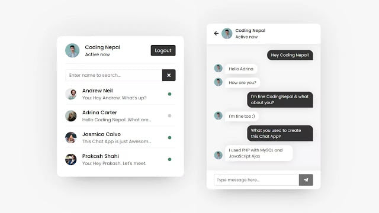

# Chatbox with Admin-Based Control

A real-time chat application with admin-based control, built using **PHP**, **MySQL**, **Pure JavaScript**, and **AJAX**. This project allows users to communicate in real-time, while admins have special privileges to manage the chatroom.

---

## Features

### User Features:
- **Real-time messaging**: Send and receive messages instantly.
- **User authentication**: Register and log in to access the chatbox.
- **Message history**: View past messages in the chatroom.

### Admin Features:
- **Admin login**: Separate login for administrators.
- **Manage users**: Admins can view, delete, or ban users.
- **Delete messages**: Admins can remove inappropriate messages.
- **Broadcast messages**: Send announcements to all users.

---

## Tech Stack

- **Frontend**: Pure JavaScript, HTML, CSS
- **Backend**: PHP
- **Database**: MySQL
- **Real-time updates**: AJAX

---

## Installation

### Prerequisites:
- PHP (>= 7.0)
- MySQL
- Web server (e.g., Apache, Nginx)

### Steps:
1. **Clone the repository**:
   ```bash
   git clone https://github.com/Iodize13/chatbox-admin-control
   cd chatbox
   ```

2. **Set up the database**:
   - Import the SQL file located in the `php/` folder into your MySQL server.
   - Update the database connection details in `config.php`.

3. **Configure the project**:
   - Open the `config.php` file and update the following:
     ```php
     $hostname = "localhost";
     $username = "root";
     $password = "";
     $dbname = "chatbox_admin_control";
     ```

4. **Run the application**:
   - Move the project folder to your web server's root directory (e.g., `htdocs` for XAMPP).
   - Access the application via your browser:
     ```
     http://localhost/chatbox
     ```

---

## Usage

### For Users:
1. Register a new account or log in if you already have one.
2. Start chatting in the chatroom.

### For Admins:
1. Log in using the admin credentials.
2. Access the admin dashboard to messages users.

---

## Folder Structure

```
chatbox-admin-control/
├── chatbox.sql
├── chat.php
├── header.php
├── images
│   └── demo.jpg
├── index.php
├── javascript
│   ├── chat.js
│   ├── login.js
│   ├── pass-show-hide.js
│   ├── signup.js
│   └── users.js
├── login.php
├── php
│   ├── config.php
│   ├── data.php
│   ├── get-chat.php
│   ├── images
│   │   ├── profilepic.jpg
│   ├── insert-chat.php
│   ├── login.php
│   ├── logout.php
│   ├── search.php
│   ├── signup.php
│   └── users.php
├── README.md
├── style.css
├── unzipper.php
└── users.php
```

---

## Screenshots


*Chat Interface*
